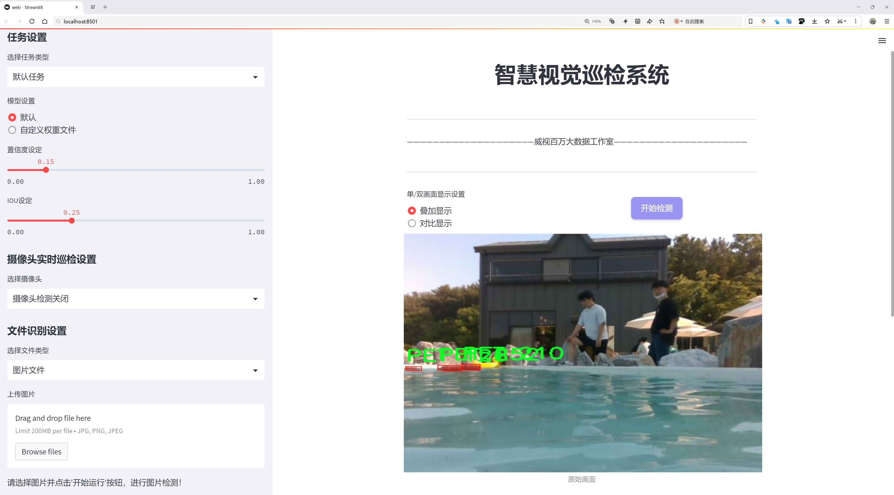
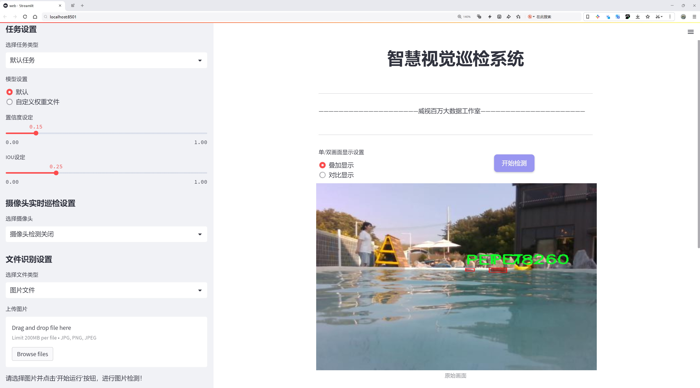
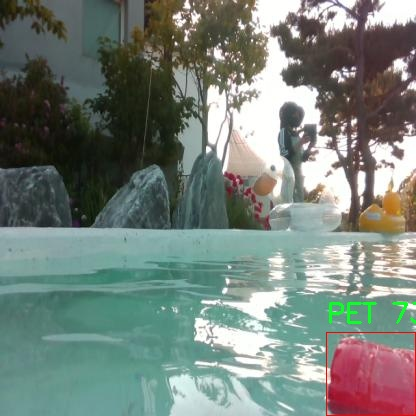
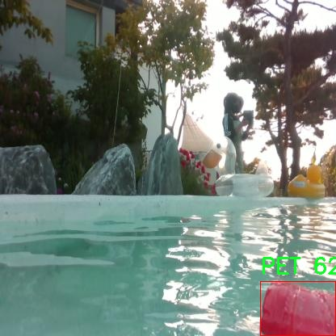

# 水面巡检船垃圾漂浮物检测检测系统源码分享
 # [一条龙教学YOLOV8标注好的数据集一键训练_70+全套改进创新点发刊_Web前端展示]

### 1.研究背景与意义

项目参考[AAAI Association for the Advancement of Artificial Intelligence](https://gitee.com/qunmasj/projects)

项目来源[AACV Association for the Advancement of Computer Vision](https://kdocs.cn/l/cszuIiCKVNis)

研究背景与意义

随着全球经济的快速发展和城市化进程的加快，水体污染问题日益严重，尤其是水面漂浮垃圾的数量不断增加，给生态环境和水资源的可持续利用带来了严峻挑战。水面垃圾不仅影响水体的美观，还对水生生物的生存环境造成了直接威胁，进而影响到人类的健康和生活质量。因此，开发高效的水面垃圾检测与清理系统，成为了当前环境保护领域亟待解决的重要课题。

近年来，深度学习技术的迅猛发展为目标检测领域带来了新的机遇。YOLO（You Only Look Once）系列模型以其高效的实时检测能力和较高的准确率，广泛应用于各种物体检测任务中。YOLOv8作为该系列的最新版本，结合了更为先进的网络结构和训练策略，能够在复杂环境中实现高效的目标检测。然而，针对特定场景的应用，尤其是水面垃圾的检测，仍然面临着许多挑战，例如环境光照变化、垃圾种类多样性及其与水面背景的相似性等问题。因此，基于改进YOLOv8的水面巡检船垃圾漂浮物检测系统的研究具有重要的现实意义。

本研究将重点关注如何利用YOLOv8模型的优势，结合特定的垃圾检测数据集，提升水面垃圾的检测精度和效率。我们所使用的数据集“trash_overfitting”包含3700张图像，专注于PET类垃圾的检测。这一数据集的构建为模型的训练和测试提供了丰富的样本，涵盖了不同的水面环境和光照条件，能够有效地模拟实际应用场景中的复杂性。此外，针对PET类垃圾的单一类别设计，能够使模型在特定目标检测上进行更深层次的学习，从而提高其在实际应用中的适应性和准确性。

在技术实现方面，我们将通过改进YOLOv8的网络结构和训练策略，增强其对水面垃圾的特征提取能力。具体而言，可以通过数据增强技术、迁移学习和模型集成等方法，进一步提升模型的泛化能力和鲁棒性。此外，结合水面巡检船的实际应用需求，设计出一套高效的垃圾检测系统，能够实时监测水面垃圾的分布情况，为后续的清理工作提供数据支持。

综上所述，基于改进YOLOv8的水面巡检船垃圾漂浮物检测系统的研究，不仅能够为水体环境保护提供技术支持，还将推动深度学习技术在环境监测领域的应用发展。通过该研究，我们期望能够为解决水面垃圾问题提供切实可行的解决方案，为保护水资源和生态环境贡献一份力量。

### 2.图片演示






##### 注意：由于此博客编辑较早，上面“2.图片演示”和“3.视频演示”展示的系统图片或者视频可能为老版本，新版本在老版本的基础上升级如下：（实际效果以升级的新版本为准）

  （1）适配了YOLOV8的“目标检测”模型和“实例分割”模型，通过加载相应的权重（.pt）文件即可自适应加载模型。

  （2）支持“图片识别”、“视频识别”、“摄像头实时识别”三种识别模式。

  （3）支持“图片识别”、“视频识别”、“摄像头实时识别”三种识别结果保存导出，解决手动导出（容易卡顿出现爆内存）存在的问题，识别完自动保存结果并导出到tempDir中。

  （4）支持Web前端系统中的标题、背景图等自定义修改，后面提供修改教程。

  另外本项目提供训练的数据集和训练教程,暂不提供权重文件（best.pt）,需要您按照教程进行训练后实现图片演示和Web前端界面演示的效果。

### 3.视频演示

[3.1 视频演示](https://www.bilibili.com/video/BV1xaxjejEc2/)

### 4.数据集信息展示

##### 4.1 本项目数据集详细数据（类别数＆类别名）

nc: 1
names: ['PET']


##### 4.2 本项目数据集信息介绍

数据集信息展示

在本研究中，我们使用了名为“trash_overfitting”的数据集，以支持改进YOLOv8的水面巡检船垃圾漂浮物检测系统的训练和测试。该数据集专注于特定类型的垃圾，即聚酯类塑料瓶（PET），并为该类别提供了丰富的标注信息。数据集的类别数量为1，具体类别为“PET”，这意味着我们将专注于识别和检测水面上漂浮的聚酯瓶，以提高系统在实际应用中的有效性和准确性。

“trash_overfitting”数据集的构建旨在解决水面巡检过程中垃圾检测的挑战，尤其是在复杂环境下的表现。该数据集包含了大量的图像样本，这些样本是在不同的光照条件、天气状况和水面状态下拍摄的，确保了模型训练的多样性和鲁棒性。通过这种方式，我们希望能够提高YOLOv8在实际应用中的适应能力，使其能够在各种环境中有效地识别和定位PET瓶。

数据集中的图像不仅包括清晰的PET瓶图像，还涵盖了部分遮挡、不同角度和距离的样本。这种多样化的样本选择使得模型能够学习到PET瓶在不同场景下的特征，从而提高检测的准确性和召回率。此外，数据集中还包含了经过精确标注的边界框信息，确保模型在训练过程中能够准确地学习到目标物体的位置和形状。

在数据预处理阶段，我们对图像进行了多种增强处理，如旋转、缩放、翻转和颜色调整，以进一步丰富数据集的多样性。这些增强技术不仅提高了模型的泛化能力，还帮助减少了过拟合的风险，使得训练出的模型在面对未见过的样本时仍能保持良好的性能。

通过使用“trash_overfitting”数据集，我们的目标是实现一个高效的水面垃圾检测系统，能够实时监测和识别水域中的PET瓶。这一系统的成功实施将为水域环境保护提供重要支持，帮助相关部门及时清理水面垃圾，维护生态平衡。此外，随着对水面垃圾问题认识的加深，未来的研究可以基于该数据集扩展到其他类型的垃圾检测，进一步提升水域巡检的智能化水平。

总之，“trash_overfitting”数据集不仅为本研究提供了必要的训练基础，还为未来的研究方向奠定了坚实的基础。通过对该数据集的深入分析和应用，我们期望能够推动水面垃圾检测技术的发展，为保护水域环境贡献一份力量。







### 5.全套项目环境部署视频教程（零基础手把手教学）

[5.1 环境部署教程链接（零基础手把手教学）](https://www.ixigua.com/7404473917358506534?logTag=c807d0cbc21c0ef59de5)


[5.2 安装Python虚拟环境创建和依赖库安装视频教程链接（零基础手把手教学）](https://www.ixigua.com/7404474678003106304?logTag=1f1041108cd1f708b01a)

### 6.手把手YOLOV8训练视频教程（零基础小白有手就能学会）

[6.1 手把手YOLOV8训练视频教程（零基础小白有手就能学会）](https://www.ixigua.com/7404477157818401292?logTag=d31a2dfd1983c9668658)

### 7.70+种全套YOLOV8创新点代码加载调参视频教程（一键加载写好的改进模型的配置文件）

[7.1 70+种全套YOLOV8创新点代码加载调参视频教程（一键加载写好的改进模型的配置文件）](https://www.ixigua.com/7404478314661806627?logTag=29066f8288e3f4eea3a4)

### 8.70+种全套YOLOV8创新点原理讲解（非科班也可以轻松写刊发刊，V10版本正在科研待更新）

由于篇幅限制，每个创新点的具体原理讲解就不一一展开，具体见下列网址中的创新点对应子项目的技术原理博客网址【Blog】：


[8.1 70+种全套YOLOV8创新点原理讲解链接](https://gitee.com/qunmasj/good)

### 9.系统功能展示（检测对象为举例，实际内容以本项目数据集为准）

图9.1.系统支持检测结果表格显示

  图9.2.系统支持置信度和IOU阈值手动调节

  图9.3.系统支持自定义加载权重文件best.pt(需要你通过步骤5中训练获得)

  图9.4.系统支持摄像头实时识别

  图9.5.系统支持图片识别

  图9.6.系统支持视频识别

  图9.7.系统支持识别结果文件自动保存

  图9.8.系统支持Excel导出检测结果数据


### 10.原始YOLOV8算法原理

原始YOLOv8算法原理

YOLOv8算法是目标检测领域的一次重要革新，代表了Ultralytics公司在YOLO系列中的最新进展。作为YOLOv5和YOLOv7的继承者，YOLOv8不仅在精度和速度上进行了显著提升，还在网络结构和训练策略上引入了多项创新。其设计理念围绕着快速、准确和易于使用，致力于在多种应用场景中实现卓越的目标检测、图像分割和图像分类性能。

YOLOv8的网络结构可以分为四个主要部分：输入层、骨干网络、颈部网络和头部网络。输入层的设计考虑到了图像的多样性和变换性，默认的输入图像尺寸为640x640，但在实际应用中，YOLOv8采用自适应图片缩放策略，以适应不同长宽比的图像。这种方法通过将图像的长边按比例缩小到指定尺寸，然后对短边进行填充，最大限度地减少了信息冗余，从而提高了目标检测的速度和准确性。此外，YOLOv8在训练阶段引入了Mosaic图像增强技术，通过将四张随机选择的图像拼接成一张新图像，迫使模型学习不同位置和周围像素的特征，显著提升了模型的泛化能力和预测精度。

在骨干网络部分，YOLOv8对YOLOv5中的C3模块进行了替换，采用了C2F模块。C2F模块的设计灵感来源于YOLOv7中的ELAN结构，增加了更多的并行梯度流分支，丰富了特征的表达能力。这种结构的优势在于，它不仅保持了轻量化的特性，还能在特征提取过程中获得更高的精度和更合理的延迟。此外，YOLOv8依然采用了FPN（特征金字塔网络）和PAN（路径聚合网络）结构，以实现多尺度信息的有效融合，确保网络在处理不同尺寸目标时的鲁棒性。

在颈部网络中，YOLOv8对特征的处理进行了优化，去除了YOLOv5中两次上采样之前的1x1卷积连接层，直接对不同阶段输出的特征进行上采样。这一改进简化了网络结构，减少了计算复杂度，同时提高了特征的传递效率。头部网络的变化则是YOLOv8最显著的改进之一，采用了解耦头结构，将分类和定位任务分开处理。通过两个并行的分支，YOLOv8能够分别提取类别特征和位置特征，从而提高了检测的准确性和效率。

YOLOv8还摒弃了传统的Anchor-Based方法，转而采用Anchor-Free的策略。这一转变使得目标检测不再依赖于预设的锚框，而是将目标检测问题转化为关键点检测。这种方法的优势在于，模型的泛化能力更强，网络框架更加简洁，同时也降低了计算复杂度。YOLOv8通过动态标签分配策略（TOOD）解决了正负样本匹配的问题，避免了因数据集不足而导致的候选框聚类不准确的问题。

在损失函数的设计上，YOLOv8引入了Varifocal Loss（VFL）和CIoU Loss与DFL Loss的组合，以提升模型对边界框预测的精准性。VFL通过不对称参数对正负样本进行加权，使得高质量的正样本对损失的贡献更大，而负样本的影响则被有效降低。这种策略确保了模型在训练过程中能够更加专注于高质量的样本，从而提升了整体的检测性能。

总的来说，YOLOv8在保留YOLO系列优良传统的基础上，通过对网络结构的优化、训练策略的改进以及损失函数的创新，展现出了卓越的性能。无论是在精度、速度还是灵活性方面，YOLOv8都为目标检测任务提供了更为强大的解决方案，使其在各类实际应用中具备了更高的实用价值。随着YOLOv8的广泛应用，目标检测技术的未来将更加光明，推动着计算机视觉领域的不断进步。


### 11.项目核心源码讲解（再也不用担心看不懂代码逻辑）

#### 11.1 code\ultralytics\hub\auth.py

以下是对代码的核心部分进行提炼和详细注释的结果：

```python
import requests  # 导入请求库，用于发送HTTP请求

# 定义API相关的常量
from ultralytics.hub.utils import HUB_API_ROOT, HUB_WEB_ROOT, request_with_credentials
from ultralytics.utils import LOGGER, SETTINGS, is_colab

API_KEY_URL = f"{HUB_WEB_ROOT}/settings?tab=api+keys"  # API密钥设置的URL

class Auth:
    """
    处理身份验证过程，包括API密钥管理、基于Cookie的身份验证和头部生成。

    支持以下身份验证方法：
    1. 直接使用API密钥。
    2. 使用浏览器Cookie进行身份验证（特别是在Google Colab中）。
    3. 提示用户输入API密钥。
    """

    id_token = api_key = model_key = False  # 初始化身份验证相关的属性

    def __init__(self, api_key="", verbose=False):
        """
        初始化Auth类，接受可选的API密钥。

        参数:
            api_key (str, optional): API密钥或组合API密钥和模型ID
        """
        # 处理输入的API密钥，去掉模型ID部分
        api_key = api_key.split("_")[0]
        self.api_key = api_key or SETTINGS.get("api_key", "")  # 设置API密钥

        # 如果提供了API密钥
        if self.api_key:
            # 检查提供的API密钥是否与设置中的密钥匹配
            if self.api_key == SETTINGS.get("api_key"):
                if verbose:
                    LOGGER.info("Authenticated ✅")  # 记录已认证信息
                return
            else:
                success = self.authenticate()  # 尝试认证
        # 如果没有提供API密钥且在Google Colab环境中
        elif is_colab():
            success = self.auth_with_cookies()  # 尝试使用Cookie认证
        else:
            success = self.request_api_key()  # 请求API密钥

        # 更新设置中的API密钥
        if success:
            SETTINGS.update({"api_key": self.api_key})
            if verbose:
                LOGGER.info("New authentication successful ✅")  # 记录新认证成功信息
        elif verbose:
            LOGGER.info(f"Retrieve API key from {API_KEY_URL}")  # 提示获取API密钥的URL

    def request_api_key(self, max_attempts=3):
        """
        提示用户输入API密钥。

        返回:
            bool: 认证成功返回True。
        """
        import getpass  # 导入获取密码的库

        for attempts in range(max_attempts):
            LOGGER.info(f"Login. Attempt {attempts + 1} of {max_attempts}")
            input_key = getpass.getpass(f"Enter API key from {API_KEY_URL} ")  # 获取用户输入的API密钥
            self.api_key = input_key.split("_")[0]  # 去掉模型ID部分
            if self.authenticate():  # 尝试认证
                return True
        raise ConnectionError("Failed to authenticate ❌")  # 超过最大尝试次数，抛出异常

    def authenticate(self) -> bool:
        """
        尝试使用id_token或API密钥进行服务器认证。

        返回:
            bool: 认证成功返回True，失败返回False。
        """
        try:
            header = self.get_auth_header()  # 获取认证头部
            if header:
                r = requests.post(f"{HUB_API_ROOT}/v1/auth", headers=header)  # 发送认证请求
                if not r.json().get("success", False):
                    raise ConnectionError("Unable to authenticate.")  # 认证失败
                return True
            raise ConnectionError("User has not authenticated locally.")  # 本地未认证
        except ConnectionError:
            self.id_token = self.api_key = False  # 重置无效的认证信息
            LOGGER.warning("Invalid API key ⚠️")  # 记录无效API密钥警告
            return False

    def auth_with_cookies(self) -> bool:
        """
        尝试通过Cookie获取认证并设置id_token。用户必须已登录HUB并在支持的浏览器中运行。

        返回:
            bool: 认证成功返回True，失败返回False。
        """
        if not is_colab():
            return False  # 目前仅支持Colab
        try:
            authn = request_with_credentials(f"{HUB_API_ROOT}/v1/auth/auto")  # 请求自动认证
            if authn.get("success", False):
                self.id_token = authn.get("data", {}).get("idToken", None)  # 设置id_token
                self.authenticate()  # 尝试认证
                return True
            raise ConnectionError("Unable to fetch browser authentication details.")  # 获取认证信息失败
        except ConnectionError:
            self.id_token = False  # 重置无效的id_token
            return False

    def get_auth_header(self):
        """
        获取用于API请求的认证头部。

        返回:
            dict: 如果设置了id_token或API密钥，则返回认证头部，否则返回None。
        """
        if self.id_token:
            return {"authorization": f"Bearer {self.id_token}"}  # 使用id_token生成认证头部
        elif self.api_key:
            return {"x-api-key": self.api_key}  # 使用API密钥生成认证头部
        return None  # 如果没有设置认证信息，则返回None
```

### 代码核心部分分析
1. **类的设计**：`Auth`类负责处理与API的身份验证，支持多种认证方式。
2. **初始化方法**：在初始化时，类会根据提供的API密钥或环境自动选择认证方式。
3. **认证方法**：提供了`authenticate`、`auth_with_cookies`和`request_api_key`等方法，分别用于不同的认证方式。
4. **错误处理**：通过异常处理机制来管理认证失败的情况，并记录相关日志信息。
5. **获取认证头部**：`get_auth_header`方法根据当前的认证状态生成适合的请求头部。

以上是对代码的核心部分进行了提炼和详细注释，帮助理解其功能和结构。

这个文件是一个用于管理身份验证的类，主要用于与Ultralytics的API进行交互。它支持多种身份验证方式，包括直接使用API密钥、使用浏览器cookie进行身份验证（特别是在Google Colab环境中），以及提示用户输入API密钥。

在类的定义中，首先定义了一些属性，包括`id_token`、`api_key`和`model_key`，这些属性初始化为`False`，用于存储身份验证所需的令牌和密钥。构造函数`__init__`接受一个可选的API密钥参数，并根据传入的密钥或设置中的密钥进行初始化。如果提供了API密钥，程序会检查该密钥是否与设置中的密钥匹配。如果匹配，则记录用户已登录的信息；如果不匹配，则尝试进行身份验证。如果没有提供API密钥且环境为Google Colab，则尝试使用浏览器cookie进行身份验证；否则，程序会请求用户输入API密钥。

`request_api_key`方法用于提示用户输入API密钥，最多尝试三次。如果用户输入的密钥有效，则返回成功；否则，抛出连接错误。`authenticate`方法尝试使用提供的API密钥或身份令牌与服务器进行身份验证，并返回是否成功的布尔值。如果身份验证失败，则重置无效的密钥并记录警告信息。

`auth_with_cookies`方法尝试通过浏览器cookie进行身份验证，前提是用户已登录到HUB并在支持的浏览器中运行。如果成功，则设置`id_token`并调用`authenticate`方法进行进一步验证。最后，`get_auth_header`方法用于生成用于API请求的身份验证头部，如果没有有效的身份令牌或API密钥，则返回`None`。

整体来看，这个文件的功能是确保用户能够安全地通过不同的方式进行身份验证，以便后续能够顺利地与Ultralytics的API进行交互。

#### 11.2 code\ultralytics\data\base.py

以下是代码中最核心的部分，并附上详细的中文注释：

```python
class BaseDataset(Dataset):
    """
    基础数据集类，用于加载和处理图像数据。

    参数:
        img_path (str): 包含图像的文件夹路径。
        imgsz (int, optional): 图像大小，默认为640。
        augment (bool, optional): 如果为True，则应用数据增强，默认为True。
        classes (list): 包含的类别列表，默认为None。
        fraction (float): 使用的数据集比例，默认为1.0（使用所有数据）。
    """

    def __init__(self, img_path, imgsz=640, augment=True, classes=None, fraction=1.0):
        """使用给定的配置和选项初始化BaseDataset。"""
        super().__init__()
        self.img_path = img_path  # 图像路径
        self.imgsz = imgsz  # 图像大小
        self.augment = augment  # 是否进行数据增强
        self.im_files = self.get_img_files(self.img_path)  # 获取图像文件列表
        self.labels = self.get_labels()  # 获取标签数据
        self.update_labels(include_class=classes)  # 更新标签以仅包含指定类别
        self.ni = len(self.labels)  # 数据集中图像的数量

    def get_img_files(self, img_path):
        """读取图像文件。"""
        try:
            f = []  # 图像文件列表
            # 遍历图像路径
            for p in img_path if isinstance(img_path, list) else [img_path]:
                p = Path(p)  # 使用Path处理路径
                if p.is_dir():  # 如果是目录
                    f += glob.glob(str(p / "**" / "*.*"), recursive=True)  # 获取目录下所有图像文件
                elif p.is_file():  # 如果是文件
                    with open(p) as t:
                        t = t.read().strip().splitlines()  # 读取文件内容
                        parent = str(p.parent) + os.sep
                        f += [x.replace("./", parent) if x.startswith("./") else x for x in t]  # 替换路径
                else:
                    raise FileNotFoundError(f"{p} 不存在")
            # 过滤出有效的图像文件
            im_files = sorted(x.replace("/", os.sep) for x in f if x.split(".")[-1].lower() in IMG_FORMATS)
            assert im_files, f"在 {img_path} 中未找到图像"
        except Exception as e:
            raise FileNotFoundError(f"从 {img_path} 加载数据时出错") from e
        if self.fraction < 1:
            im_files = im_files[: round(len(im_files) * self.fraction)]  # 根据比例筛选图像
        return im_files

    def update_labels(self, include_class: Optional[list]):
        """更新标签以仅包含这些类别（可选）。"""
        include_class_array = np.array(include_class).reshape(1, -1)  # 将类别转换为数组
        for i in range(len(self.labels)):
            if include_class is not None:
                cls = self.labels[i]["cls"]  # 获取当前标签的类别
                bboxes = self.labels[i]["bboxes"]  # 获取当前标签的边界框
                j = (cls == include_class_array).any(1)  # 检查类别是否在包含的类别中
                self.labels[i]["cls"] = cls[j]  # 更新类别
                self.labels[i]["bboxes"] = bboxes[j]  # 更新边界框

    def load_image(self, i):
        """从数据集中加载图像，返回图像及其原始和调整后的尺寸。"""
        im, f = None, self.im_files[i]  # 初始化图像和文件路径
        im = cv2.imread(f)  # 读取图像
        if im is None:
            raise FileNotFoundError(f"未找到图像 {f}")

        h0, w0 = im.shape[:2]  # 获取原始图像的高度和宽度
        r = self.imgsz / max(h0, w0)  # 计算缩放比例
        if r != 1:  # 如果需要调整大小
            w, h = (min(math.ceil(w0 * r), self.imgsz), min(math.ceil(h0 * r), self.imgsz))
            im = cv2.resize(im, (w, h), interpolation=cv2.INTER_LINEAR)  # 调整图像大小

        return im, (h0, w0), im.shape[:2]  # 返回图像及其尺寸信息

    def __getitem__(self, index):
        """返回给定索引的转换标签信息。"""
        return self.transforms(self.get_image_and_label(index))  # 应用转换并返回标签信息

    def __len__(self):
        """返回数据集中标签列表的长度。"""
        return len(self.labels)  # 返回标签数量

    def get_labels(self):
        """
        用户可以自定义标签格式。

        确保输出是一个包含以下键的字典：
        - im_file: 图像文件路径
        - shape: 图像形状 (高度, 宽度)
        - cls: 类别
        - bboxes: 边界框
        """
        raise NotImplementedError  # 需要用户实现
```

### 代码核心部分说明：
1. **BaseDataset类**：这是一个基础数据集类，继承自PyTorch的`Dataset`类，主要用于加载和处理图像数据。
2. **初始化方法**：接收图像路径、图像大小、是否进行数据增强等参数，并初始化图像文件和标签。
3. **获取图像文件**：`get_img_files`方法用于读取指定路径下的图像文件，并根据需要筛选。
4. **更新标签**：`update_labels`方法根据用户指定的类别更新标签信息。
5. **加载图像**：`load_image`方法用于加载单个图像，并根据需要调整其大小。
6. **获取标签**：`get_labels`方法是一个抽象方法，用户需要实现以自定义标签格式。
7. **数据集长度**：`__len__`方法返回数据集中标签的数量，便于迭代。

这些核心部分构成了数据集的基本框架，支持图像的加载、处理和标签的管理。

这个程序文件定义了一个名为 `BaseDataset` 的类，主要用于加载和处理图像数据，特别是在深度学习模型训练过程中。该类继承自 PyTorch 的 `Dataset` 类，提供了一系列方法和属性来管理图像数据集。

在初始化方法 `__init__` 中，用户可以传入多个参数，例如图像路径、图像大小、是否缓存图像、是否应用数据增强等。类会根据传入的图像路径读取图像文件，并存储在 `im_files` 列表中，同时调用 `get_labels` 方法获取标签信息。根据是否需要单类训练和指定的类，更新标签信息。类还会根据是否需要矩形训练设置相应的参数。

`get_img_files` 方法用于读取指定路径下的图像文件，支持从文件列表中读取和从目录中递归查找图像。该方法会确保只返回支持的图像格式，并根据需要返回部分数据集。`update_labels` 方法则根据用户指定的类更新标签信息，确保只保留所需的类。

`load_image` 方法用于加载指定索引的图像，支持从缓存中读取或从磁盘加载图像，并根据需要调整图像大小。该方法还会将图像添加到缓冲区，以便在进行数据增强时使用。

`cache_images` 方法负责将图像缓存到内存或磁盘，以提高后续加载的速度。`check_cache_ram` 方法用于检查可用内存是否足够缓存图像，确保在内存不足时不会发生错误。

`set_rectangle` 方法用于设置 YOLO 检测的边界框形状为矩形，适用于需要矩形训练的情况。`__getitem__` 方法返回给定索引的图像和标签信息，并应用预定义的转换。`__len__` 方法返回数据集中标签的数量。

此外，类中还定义了 `build_transforms` 和 `get_labels` 方法，这两个方法是留给用户自定义的，用户可以根据自己的需求实现数据增强和标签格式化的逻辑。

总的来说，`BaseDataset` 类提供了一个灵活的框架，用于处理图像数据集，支持多种配置选项，方便用户在深度学习任务中使用。

#### 11.3 70+种YOLOv8算法改进源码大全和调试加载训练教程（非必要）\ultralytics\utils\benchmarks.py

以下是代码中最核心的部分，并附上详细的中文注释：

```python
import time
import numpy as np
import pandas as pd
from ultralytics import YOLO
from ultralytics.utils import select_device, check_requirements, check_yolo, file_size, TQDM

def benchmark(model='yolov8n.pt', imgsz=160, half=False, int8=False, device='cpu', verbose=False):
    """
    对YOLO模型进行基准测试，评估不同格式的速度和准确性。

    参数:
        model (str): 模型文件的路径，默认为'yolov8n.pt'。
        imgsz (int): 基准测试使用的图像大小，默认为160。
        half (bool): 是否使用半精度模型，默认为False。
        int8 (bool): 是否使用int8精度模型，默认为False。
        device (str): 运行基准测试的设备，可以是'cpu'或'cuda'，默认为'cpu'。
        verbose (bool): 如果为True，将输出详细的基准测试信息，默认为False。

    返回:
        df (pandas.DataFrame): 包含每种格式的基准测试结果的DataFrame，包括文件大小、指标和推理时间。
    """
    
    # 选择设备（CPU或GPU）
    device = select_device(device, verbose=False)
    
    # 加载模型
    model = YOLO(model)

    results = []  # 存储结果的列表
    start_time = time.time()  # 记录开始时间

    # 遍历不同的导出格式
    for i, (name, format, suffix, cpu, gpu) in export_formats().iterrows():
        emoji, filename = '❌', None  # 默认导出状态为失败
        try:
            # 确保当前环境支持所需的导出格式
            if 'cpu' in device.type:
                assert cpu, 'CPU不支持此推理'
            if 'cuda' in device.type:
                assert gpu, 'GPU不支持此推理'

            # 导出模型
            if format == '-':
                filename = model.ckpt_path or model.cfg  # PyTorch格式
            else:
                filename = model.export(imgsz=imgsz, format=format, half=half, int8=int8, device=device, verbose=False)
                exported_model = YOLO(filename, task=model.task)
                assert suffix in str(filename), '导出失败'
            emoji = '✅'  # 导出成功

            # 进行推理
            exported_model.predict('path/to/sample/image.jpg', imgsz=imgsz, device=device, half=half)

            # 验证模型
            results_dict = exported_model.val(data='path/to/dataset.yaml', batch=1, imgsz=imgsz, device=device, half=half, int8=int8, verbose=False)
            metric, speed = results_dict.results_dict['mAP'], results_dict.speed['inference']
            results.append([name, emoji, round(file_size(filename), 1), round(metric, 4), round(speed, 2)])
        except Exception as e:
            # 捕获异常并记录错误
            results.append([name, emoji, round(file_size(filename), 1), None, None])  # 记录失败的结果

    # 打印结果
    check_yolo(device=device)  # 打印系统信息
    df = pd.DataFrame(results, columns=['Format', 'Status', 'Size (MB)', 'Metric', 'Inference time (ms/im)'])

    # 记录基准测试完成的信息
    log_message = f'\n基准测试完成，耗时 {time.time() - start_time:.2f}s\n{df}\n'
    print(log_message)  # 输出结果
    return df  # 返回结果DataFrame
```

### 代码说明：
1. **导入必要的库**：导入了时间、NumPy、Pandas等库，以及YOLO模型和一些工具函数。
2. **benchmark函数**：这是进行基准测试的主要函数，接受多个参数以配置测试。
3. **设备选择**：根据用户输入选择运行设备（CPU或GPU）。
4. **模型加载**：加载指定路径的YOLO模型。
5. **结果存储**：初始化一个列表来存储每种格式的测试结果。
6. **导出和推理**：遍历所有支持的导出格式，导出模型并进行推理，捕获任何可能的异常。
7. **结果记录**：将每个格式的结果（包括文件大小、指标和推理时间）存储到结果列表中。
8. **结果输出**：将结果转换为DataFrame格式并打印，同时记录基准测试的总耗时。

这段代码的核心功能是对YOLO模型进行基准测试，评估其在不同格式下的性能表现。

这个程序文件是用于基准测试YOLO模型的速度和准确性，主要包含两个类：`benchmark`和`ProfileModels`。首先，文件中提供了如何使用这些功能的说明，包括如何导入相关模块和调用基准测试的示例。

在`benchmark`函数中，用户可以指定模型文件、数据集、图像大小、设备类型等参数。该函数的主要功能是对YOLO模型进行基准测试，输出不同格式模型的性能数据，包括文件大小、准确性指标和推理时间。函数内部首先选择设备（CPU或GPU），然后通过遍历支持的导出格式，导出模型并进行推理。每种格式的模型都会进行验证，并记录其性能指标。最终，结果以`pandas.DataFrame`的形式返回，并输出到日志文件中。

`ProfileModels`类则用于对多个模型进行性能分析，支持ONNX和TensorRT格式。它的构造函数接收模型路径、运行次数、图像大小等参数。`profile`方法会遍历指定的模型文件，导出ONNX和TensorRT格式的模型，并进行基准测试。测试结果包括模型的平均运行时间和标准差等信息，并以表格形式输出。

此外，文件中还包含了一些辅助函数，例如获取文件、获取ONNX模型信息、进行模型性能分析等。这些功能结合在一起，使得用户能够方便地对YOLO模型进行性能评估和比较，帮助用户选择合适的模型和配置。整体来看，这个文件是YOLO模型性能测试和分析的重要工具，适合深度学习研究人员和开发者使用。

#### 11.4 train.py

以下是代码中最核心的部分，并附上详细的中文注释：

```python
class DetectionTrainer(BaseTrainer):
    """
    扩展自 BaseTrainer 类的检测模型训练类。
    用于训练 YOLO 检测模型。
    """

    def build_dataset(self, img_path, mode="train", batch=None):
        """
        构建 YOLO 数据集。

        参数:
            img_path (str): 包含图像的文件夹路径。
            mode (str): 模式，`train` 表示训练模式，`val` 表示验证模式。
            batch (int, optional): 批次大小，仅用于 `rect` 模式。默认为 None。
        """
        gs = max(int(de_parallel(self.model).stride.max() if self.model else 0), 32)
        return build_yolo_dataset(self.args, img_path, batch, self.data, mode=mode, rect=mode == "val", stride=gs)

    def get_dataloader(self, dataset_path, batch_size=16, rank=0, mode="train"):
        """构造并返回数据加载器。"""
        assert mode in ["train", "val"]  # 确保模式有效
        with torch_distributed_zero_first(rank):  # 在分布式训练中，仅初始化一次数据集
            dataset = self.build_dataset(dataset_path, mode, batch_size)
        shuffle = mode == "train"  # 训练模式下打乱数据
        if getattr(dataset, "rect", False) and shuffle:
            LOGGER.warning("WARNING ⚠️ 'rect=True' 与 DataLoader 的 shuffle 不兼容，设置 shuffle=False")
            shuffle = False
        workers = self.args.workers if mode == "train" else self.args.workers * 2  # 根据模式设置工作线程数
        return build_dataloader(dataset, batch_size, workers, shuffle, rank)  # 返回数据加载器

    def preprocess_batch(self, batch):
        """对一批图像进行预处理，包括缩放和转换为浮点数。"""
        batch["img"] = batch["img"].to(self.device, non_blocking=True).float() / 255  # 将图像数据转换为浮点数并归一化
        if self.args.multi_scale:  # 如果启用多尺度训练
            imgs = batch["img"]
            sz = (
                random.randrange(self.args.imgsz * 0.5, self.args.imgsz * 1.5 + self.stride)
                // self.stride
                * self.stride
            )  # 随机选择图像大小
            sf = sz / max(imgs.shape[2:])  # 计算缩放因子
            if sf != 1:  # 如果缩放因子不为1
                ns = [
                    math.ceil(x * sf / self.stride) * self.stride for x in imgs.shape[2:]
                ]  # 计算新的图像形状
                imgs = nn.functional.interpolate(imgs, size=ns, mode="bilinear", align_corners=False)  # 进行插值缩放
            batch["img"] = imgs  # 更新批次中的图像
        return batch

    def get_model(self, cfg=None, weights=None, verbose=True):
        """返回 YOLO 检测模型。"""
        model = DetectionModel(cfg, nc=self.data["nc"], verbose=verbose and RANK == -1)  # 创建检测模型
        if weights:
            model.load(weights)  # 加载权重
        return model

    def get_validator(self):
        """返回用于 YOLO 模型验证的 DetectionValidator。"""
        self.loss_names = "box_loss", "cls_loss", "dfl_loss"  # 定义损失名称
        return yolo.detect.DetectionValidator(
            self.test_loader, save_dir=self.save_dir, args=copy(self.args), _callbacks=self.callbacks
        )

    def plot_training_samples(self, batch, ni):
        """绘制带有注释的训练样本。"""
        plot_images(
            images=batch["img"],
            batch_idx=batch["batch_idx"],
            cls=batch["cls"].squeeze(-1),
            bboxes=batch["bboxes"],
            paths=batch["im_file"],
            fname=self.save_dir / f"train_batch{ni}.jpg",
            on_plot=self.on_plot,
        )
```

### 代码核心部分说明：
1. **DetectionTrainer 类**：这是一个用于训练 YOLO 检测模型的类，继承自 `BaseTrainer`。
2. **build_dataset 方法**：构建 YOLO 数据集，处理图像路径和模式（训练或验证）。
3. **get_dataloader 方法**：构造数据加载器，设置批次大小和工作线程数，并处理数据打乱。
4. **preprocess_batch 方法**：对图像批次进行预处理，包括归一化和多尺度调整。
5. **get_model 方法**：返回一个 YOLO 检测模型，并可选择加载预训练权重。
6. **get_validator 方法**：返回用于模型验证的验证器。
7. **plot_training_samples 方法**：绘制训练样本及其注释，便于可视化训练过程。

这些方法和类构成了 YOLO 模型训练的核心逻辑，负责数据处理、模型构建和训练过程中的可视化。

这个程序文件 `train.py` 是一个用于训练目标检测模型的代码，主要基于 YOLO（You Only Look Once）架构。代码中定义了一个名为 `DetectionTrainer` 的类，该类继承自 `BaseTrainer`，并实现了一系列与训练过程相关的方法。

首先，类的构造函数并未在代码中直接显示，但可以推测其初始化过程会涉及到模型、数据集、训练参数等的设置。`DetectionTrainer` 类的主要功能是构建和管理训练过程，包括数据集的构建、数据加载、模型的预处理、损失计算等。

在 `build_dataset` 方法中，程序根据给定的图像路径和模式（训练或验证）构建 YOLO 数据集。该方法会调用 `build_yolo_dataset` 函数，设置图像的批量大小和其他参数。

`get_dataloader` 方法用于创建数据加载器。它会根据模式（训练或验证）选择合适的参数，并确保在分布式训练中只初始化一次数据集。此方法还会处理数据集的打乱（shuffle）选项，确保在训练模式下数据是随机的。

`preprocess_batch` 方法负责对输入的图像批次进行预处理，包括将图像缩放到合适的大小并转换为浮点数格式。该方法还支持多尺度训练，即在每个训练周期随机选择图像的大小，以增强模型的鲁棒性。

`set_model_attributes` 方法用于设置模型的属性，例如类别数量和类别名称等，以确保模型与数据集的匹配。

`get_model` 方法返回一个 YOLO 检测模型，并可以选择加载预训练权重。这个方法是构建模型的关键部分。

`get_validator` 方法返回一个用于验证模型性能的验证器，记录损失值等信息，以便在训练过程中监控模型的表现。

`label_loss_items` 方法用于生成带有标签的损失字典，方便后续的损失分析。

`progress_string` 方法生成一个格式化的字符串，用于显示训练进度，包括当前的 epoch、GPU 内存使用情况、损失值等信息。

`plot_training_samples` 方法用于绘制训练样本及其标注，便于可视化训练过程中的样本质量。

最后，`plot_metrics` 和 `plot_training_labels` 方法分别用于绘制训练过程中的指标和标注图，以便分析模型的训练效果。

整体来看，这个程序文件实现了 YOLO 模型的训练流程，涵盖了数据处理、模型构建、训练监控和结果可视化等多个方面，适合用于目标检测任务的深度学习研究和应用。

#### 11.5 code\ultralytics\engine\validator.py

以下是代码中最核心的部分，并附上详细的中文注释：

```python
class BaseValidator:
    """
    BaseValidator类用于创建验证器的基类。

    属性:
        args (SimpleNamespace): 验证器的配置。
        dataloader (DataLoader): 用于验证的数据加载器。
        model (nn.Module): 要验证的模型。
        device (torch.device): 用于验证的设备。
        speed (dict): 包含预处理、推理、损失和后处理的处理时间。
        save_dir (Path): 保存结果的目录。
    """

    def __init__(self, dataloader=None, save_dir=None, args=None):
        """
        初始化BaseValidator实例。

        参数:
            dataloader (torch.utils.data.DataLoader): 用于验证的数据加载器。
            save_dir (Path, optional): 保存结果的目录。
            args (SimpleNamespace): 验证器的配置。
        """
        self.args = get_cfg(overrides=args)  # 获取配置
        self.dataloader = dataloader  # 数据加载器
        self.device = None  # 设备
        self.save_dir = save_dir or get_save_dir(self.args)  # 保存目录
        self.speed = {"preprocess": 0.0, "inference": 0.0, "loss": 0.0, "postprocess": 0.0}  # 处理速度字典

    @smart_inference_mode()
    def __call__(self, trainer=None, model=None):
        """支持验证预训练模型或正在训练的模型。"""
        self.device = select_device(self.args.device)  # 选择设备
        model = AutoBackend(model or self.args.model, device=self.device)  # 初始化模型
        model.eval()  # 设置模型为评估模式

        # 处理数据集
        self.dataloader = self.dataloader or self.get_dataloader(self.args.data, self.args.batch)

        # 运行验证过程
        for batch_i, batch in enumerate(self.dataloader):
            # 预处理
            batch = self.preprocess(batch)

            # 推理
            preds = model(batch["img"])

            # 更新指标
            self.update_metrics(preds, batch)

        # 获取统计信息
        stats = self.get_stats()
        self.print_results()  # 打印结果
        return stats  # 返回统计信息

    def preprocess(self, batch):
        """预处理输入批次。"""
        return batch  # 这里可以添加实际的预处理逻辑

    def update_metrics(self, preds, batch):
        """根据预测和批次更新指标。"""
        pass  # 这里可以添加实际的指标更新逻辑

    def get_stats(self):
        """返回模型性能的统计信息。"""
        return {}  # 这里可以返回实际的统计信息

    def print_results(self):
        """打印模型预测的结果。"""
        pass  # 这里可以添加实际的结果打印逻辑
```

### 代码核心部分说明：
1. **BaseValidator类**：这是一个基类，用于实现模型验证的功能。它包含了模型验证所需的基本属性和方法。
  
2. **`__init__`方法**：初始化验证器实例，设置配置、数据加载器、设备和保存目录等。

3. **`__call__`方法**：使得该类的实例可以被调用，执行验证过程。根据是否传入训练器或模型，选择相应的模型进行验证。

4. **`preprocess`方法**：对输入批次进行预处理，可以在这里添加具体的预处理逻辑。

5. **`update_metrics`方法**：根据模型的预测结果和输入批次更新性能指标，具体逻辑可以在这里实现。

6. **`get_stats`方法**：返回模型性能的统计信息，可以在这里实现具体的统计逻辑。

7. **`print_results`方法**：打印模型的预测结果，具体实现可以在这里添加。

这些方法和属性构成了模型验证的基本框架，用户可以在此基础上扩展具体的实现逻辑。

这个程序文件 `validator.py` 是 Ultralytics YOLO（You Only Look Once）模型的一部分，主要用于验证模型在测试集或验证集上的准确性。文件中包含了一个名为 `BaseValidator` 的类，作为创建验证器的基础类。该类的构造函数接受数据加载器、保存目录、进度条、配置参数和回调函数等参数，并初始化了一系列属性，用于存储验证过程中的信息。

在 `BaseValidator` 类中，定义了多个方法来支持模型验证的各个环节。`__call__` 方法是验证的核心，支持对预训练模型或正在训练的模型进行验证。根据传入的参数，方法会设置训练模式、设备、数据集等，并进行模型的推理和损失计算。它还会在验证过程中收集统计信息，并根据需要生成可视化结果。

该类还包含了一些用于处理预测结果的方法，例如 `match_predictions` 用于将预测结果与真实标签进行匹配，`add_callback` 和 `run_callbacks` 用于管理和执行回调函数。数据加载器的获取和数据集的构建是通过未实现的方法 `get_dataloader` 和 `build_dataset` 来完成的，这意味着具体的实现需要在子类中定义。

此外，类中还定义了一些用于性能指标的初始化、更新和最终化的方法，如 `init_metrics`、`update_metrics` 和 `finalize_metrics`，这些方法的具体实现同样留待子类完成。文件的最后部分包含了一些用于绘制验证样本和预测结果的占位方法。

总的来说，这个文件为 YOLO 模型的验证过程提供了一个结构化的框架，支持多种模型格式，并能够在验证过程中收集和输出性能指标。

#### 11.6 70+种YOLOv8算法改进源码大全和调试加载训练教程（非必要）\ultralytics\data\build.py

以下是经过简化和注释的核心代码部分：

```python
import os
import random
import numpy as np
import torch
from torch.utils.data import dataloader
from .dataset import YOLODataset  # 导入YOLO数据集类
from .utils import PIN_MEMORY  # 导入内存固定标志

class InfiniteDataLoader(dataloader.DataLoader):
    """
    自定义的数据加载器，能够无限循环使用工作线程。
    """

    def __init__(self, *args, **kwargs):
        """初始化InfiniteDataLoader，继承自DataLoader。"""
        super().__init__(*args, **kwargs)
        # 使用自定义的重复采样器
        object.__setattr__(self, 'batch_sampler', _RepeatSampler(self.batch_sampler))
        self.iterator = super().__iter__()

    def __len__(self):
        """返回批次采样器的长度。"""
        return len(self.batch_sampler.sampler)

    def __iter__(self):
        """创建一个无限重复的迭代器。"""
        for _ in range(len(self)):
            yield next(self.iterator)

    def reset(self):
        """重置迭代器，便于在训练时修改数据集设置。"""
        self.iterator = self._get_iterator()

class _RepeatSampler:
    """
    自定义的采样器，能够无限重复给定的采样器。
    """

    def __init__(self, sampler):
        """初始化重复采样器。"""
        self.sampler = sampler

    def __iter__(self):
        """无限迭代给定的采样器。"""
        while True:
            yield from iter(self.sampler)

def seed_worker(worker_id):
    """设置数据加载器工作线程的随机种子，以确保可重复性。"""
    worker_seed = torch.initial_seed() % 2 ** 32
    np.random.seed(worker_seed)
    random.seed(worker_seed)

def build_yolo_dataset(cfg, img_path, batch, data, mode='train', rect=False, stride=32):
    """构建YOLO数据集。"""
    return YOLODataset(
        img_path=img_path,
        imgsz=cfg.imgsz,  # 图像大小
        batch_size=batch,  # 批次大小
        augment=mode == 'train',  # 是否进行数据增强
        hyp=cfg,  # 超参数配置
        rect=cfg.rect or rect,  # 是否使用矩形批次
        cache=cfg.cache or None,  # 是否缓存数据
        single_cls=cfg.single_cls or False,  # 是否单类
        stride=int(stride),  # 步幅
        pad=0.0 if mode == 'train' else 0.5,  # 填充
        classes=cfg.classes,  # 类别
        data=data,  # 数据配置
        fraction=cfg.fraction if mode == 'train' else 1.0  # 训练时的样本比例
    )

def build_dataloader(dataset, batch, workers, shuffle=True, rank=-1):
    """返回用于训练或验证集的InfiniteDataLoader或DataLoader。"""
    batch = min(batch, len(dataset))  # 确保批次大小不超过数据集大小
    nd = torch.cuda.device_count()  # CUDA设备数量
    nw = min([os.cpu_count() // max(nd, 1), batch if batch > 1 else 0, workers])  # 工作线程数量
    sampler = None if rank == -1 else distributed.DistributedSampler(dataset, shuffle=shuffle)  # 分布式采样器
    generator = torch.Generator()
    generator.manual_seed(6148914691236517205 + RANK)  # 设置随机种子
    return InfiniteDataLoader(dataset=dataset,
                              batch_size=batch,
                              shuffle=shuffle and sampler is None,
                              num_workers=nw,
                              sampler=sampler,
                              pin_memory=PIN_MEMORY,
                              worker_init_fn=seed_worker)  # 初始化工作线程的随机种子

def check_source(source):
    """检查输入源的类型并返回相应的标志值。"""
    # 初始化标志
    webcam, screenshot, from_img, in_memory, tensor = False, False, False, False, False
    if isinstance(source, (str, int, Path)):  # 处理字符串、整数或路径
        source = str(source)
        is_file = Path(source).suffix[1:] in (IMG_FORMATS + VID_FORMATS)  # 检查是否为文件
        is_url = source.lower().startswith(('https://', 'http://', 'rtsp://', 'rtmp://', 'tcp://'))  # 检查是否为URL
        webcam = source.isnumeric() or source.endswith('.streams') or (is_url and not is_file)  # 检查是否为摄像头
        screenshot = source.lower() == 'screen'  # 检查是否为屏幕截图
    elif isinstance(source, LOADERS):
        in_memory = True  # 如果是LOADERS类型，则标记为内存中的数据
    elif isinstance(source, (list, tuple)):
        source = autocast_list(source)  # 转换列表元素为PIL或numpy数组
        from_img = True
    elif isinstance(source, (Image.Image, np.ndarray)):
        from_img = True  # 如果是图像或数组
    elif isinstance(source, torch.Tensor):
        tensor = True  # 如果是Tensor
    else:
        raise TypeError('不支持的图像类型。')

    return source, webcam, screenshot, from_img, in_memory, tensor

def load_inference_source(source=None, imgsz=640, vid_stride=1, buffer=False):
    """
    加载用于目标检测的推理源并应用必要的转换。
    """
    source, webcam, screenshot, from_img, in_memory, tensor = check_source(source)  # 检查源类型
    # 根据源类型加载相应的数据集
    if tensor:
        dataset = LoadTensor(source)
    elif in_memory:
        dataset = source
    elif webcam:
        dataset = LoadStreams(source, imgsz=imgsz, vid_stride=vid_stride, buffer=buffer)
    elif screenshot:
        dataset = LoadScreenshots(source, imgsz=imgsz)
    elif from_img:
        dataset = LoadPilAndNumpy(source, imgsz=imgsz)
    else:
        dataset = LoadImages(source, imgsz=imgsz, vid_stride=vid_stride)

    return dataset  # 返回加载好的数据集
```

### 代码说明：
1. **InfiniteDataLoader**: 自定义的数据加载器，支持无限循环读取数据，适用于需要不断迭代的数据集。
2. **_RepeatSampler**: 实现了一个无限重复的采样器，能够在数据用尽后继续返回数据。
3. **seed_worker**: 设置工作线程的随机种子，确保每次运行时的随机性一致。
4. **build_yolo_dataset**: 根据配置构建YOLO数据集，支持数据增强、批次大小、类别等设置。
5. **build_dataloader**: 创建数据加载器，支持多线程和分布式训练。
6. **check_source**: 检查输入源的类型（如文件、URL、图像等），并返回相应的标志。
7. **load_inference_source**: 加载用于推理的数据源，应用必要的转换，返回相应的数据集对象。

这个程序文件是用于构建YOLOv8算法的数据加载和处理模块，主要功能是创建数据集和数据加载器，以便在训练和推理过程中使用。程序首先导入了一些必要的库和模块，包括操作系统相关的库、随机数生成库、路径处理库、NumPy、PyTorch、PIL图像处理库等。

在文件中定义了一个名为`InfiniteDataLoader`的类，它继承自PyTorch的`DataLoader`。这个类的主要特点是可以无限循环地使用工作线程，适用于需要持续训练的场景。它重写了`__len__`和`__iter__`方法，使得每次迭代都能返回新的批次数据，并且提供了一个`reset`方法，可以在训练过程中重置迭代器。

接下来，定义了一个名为`_RepeatSampler`的内部类，用于实现一个永远重复的采样器。这个采样器会不断迭代给定的采样器，确保数据加载的连续性。

`seed_worker`函数用于设置数据加载器工作线程的随机种子，以确保每次运行时的随机性一致性。这对于调试和结果的可重复性非常重要。

`build_yolo_dataset`函数用于构建YOLO数据集。它接收配置参数、图像路径、批次大小等信息，并返回一个`YOLODataset`对象。这个对象包含了图像的增强、批次处理、缓存等功能，适用于训练或验证模式。

`build_dataloader`函数则是用于返回一个`InfiniteDataLoader`或普通的`DataLoader`，它根据输入的数据集、批次大小、工作线程数量等参数进行配置。它还支持分布式训练的采样器，并设置了随机种子以确保数据加载的一致性。

`check_source`函数用于检查输入源的类型，并返回相应的标志值。这些标志值指示输入源是来自文件、摄像头、内存、张量还是其他类型，并根据需要进行处理。

最后，`load_inference_source`函数用于加载推理源，并应用必要的转换。它接收输入源、图像大小、视频帧间隔等参数，调用`check_source`函数来确定输入源的类型，然后根据不同的输入类型创建相应的数据集对象。

总体来说，这个程序文件的核心功能是提供一个灵活且高效的数据加载机制，以支持YOLOv8算法在训练和推理过程中的数据处理需求。

### 12.系统整体结构（节选）

### 整体功能和构架概括

该项目是一个基于YOLOv8算法的目标检测框架，包含了模型训练、验证、数据处理、性能基准测试等多个模块。整体架构旨在提供一个灵活、高效的工具集，以支持用户在目标检测任务中的各种需求。项目的主要功能模块包括：

1. **身份验证**：提供与Ultralytics API的身份验证功能。
2. **数据处理**：包括数据集的构建、数据加载和预处理，支持多种数据增强和缓存机制。
3. **模型训练**：实现YOLO模型的训练流程，支持多种配置和参数设置。
4. **模型验证**：对训练好的模型进行验证，计算准确性和损失等指标。
5. **性能基准测试**：评估模型在不同格式下的推理速度和准确性。
6. **推理和预测**：支持模型的推理和结果预测功能。
7. **可视化**：提供训练过程中的样本可视化和性能指标绘制。

以下是各个文件的功能整理表格：

| 文件路径                                                                                   | 功能描述                                                     |
|------------------------------------------------------------------------------------------|----------------------------------------------------------|
| `code\ultralytics\hub\auth.py`                                                          | 管理与Ultralytics API的身份验证，支持API密钥和cookie。       |
| `code\ultralytics\data\base.py`                                                         | 定义基础数据集类，处理图像数据加载和预处理。                 |
| `70+种YOLOv8算法改进源码大全和调试加载训练教程（非必要）\ultralytics\utils\benchmarks.py` | 进行模型性能基准测试，评估推理速度和准确性。                   |
| `train.py`                                                                               | 实现YOLO模型的训练流程，包括数据加载、模型构建和训练监控。    |
| `code\ultralytics\engine\validator.py`                                                  | 定义模型验证器，计算验证集上的准确性和损失。                   |
| `70+种YOLOv8算法改进源码大全和调试加载训练教程（非必要）\ultralytics\data\build.py`       | 构建数据集和数据加载器，支持无限循环的数据加载。               |
| `70+种YOLOv8算法改进源码大全和调试加载训练教程（非必要）\ultralytics\models\sam\predict.py` | 实现目标检测模型的推理和预测功能。                           |
| `70+种YOLOv8算法改进源码大全和调试加载训练教程（非必要）\ultralytics\models\rtdetr\train.py` | 实现RT-DETR模型的训练流程。                                 |
| `code\ultralytics\solutions\heatmap.py`                                                | 处理热图生成和可视化，支持目标检测结果的可视化展示。           |
| `ui.py`                                                                                  | 提供用户界面相关的功能，可能用于模型推理的可视化界面。         |
| `70+种YOLOv8算法改进源码大全和调试加载训练教程（非必要）\ultralytics\utils\torch_utils.py` | 提供与PyTorch相关的工具函数，支持模型训练和推理。             |
| `code\ultralytics\engine\exporter.py`                                                  | 实现模型导出功能，支持将训练好的模型导出为不同格式。           |
| `70+种YOLOv8算法改进源码大全和调试加载训练教程（非必要）\ultralytics\nn\modules\block.py` | 定义神经网络模块和构建块，支持模型的构建和训练。               |

该项目的设计使得用户能够方便地进行目标检测模型的训练、验证和推理，同时提供了必要的工具和接口以支持多种应用场景。

注意：由于此博客编辑较早，上面“11.项目核心源码讲解（再也不用担心看不懂代码逻辑）”中部分代码可能会优化升级，仅供参考学习，完整“训练源码”、“Web前端界面”和“70+种创新点源码”以“13.完整训练+Web前端界面+70+种创新点源码、数据集获取”的内容为准。

### 13.完整训练+Web前端界面+70+种创新点源码、数据集获取


# [下载链接：https://mbd.pub/o/bread/ZpuZmpZw](https://mbd.pub/o/bread/ZpuZmpZw)